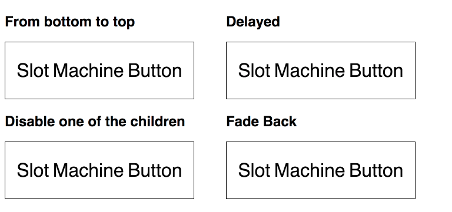

# React Slot Machine Button

[](https://www.npmjs.com/package/slot-machine-button)



## Install and Import

```sh
npm i slot-machine-button -S
```

Within a React project:

```jsx
// SomeComponent.js

import React from 'react';
import SlotMachineButton from 'slot-machine-button';

// ...
```

## Example

#### 1 minute setup

```jsx
<SlotMachineButton
  activeOnHover={true}
>
  <span>Slot</span>
  <span>Slot</span>
  <span>Machine</span>
  <span>Machine</span>
  <span>Button</span>
  <span>Button</span>
</SlotMachineButton>
```

#### A more complex one

```jsx
<SlotMachineButton
  activeOnHover={true}
  bottomToTop={true}
  delay={[0, 0.3]}
  element="div"
  className="slot-machine-button"
  fadeBack={true}
  domAttributes={{
    'aria-label': 'button'
  }}
>
  <span data-slot-disable>Slot</span>
  <span data-slot-duplicate>Machine</span>
  <span data-slot-duplicate>Button</span>
</SlotMachineButton>
```

## Children

There are two props can be passed to the children:

- `data-slot-disable` to disable the effect for the child even if it's placed within the component.

- `data-slot-duplicate` to clone the child, in order to have two identical children to do the effect.

Each group of children will be placed in a `.wheel` class,
and the elements of two states inside will have the classes `.active.part` or `.idle.part` respectively.

## PropTypes

Available props:

props                   | type     | description                                  | default
-----                   | ----     | -----------                                  | -------
`activeOnHover`         | boolean  | activate the slot effect on hover            | none (`false`)
`bottomToTop`           | boolean  | direction of the slot effect                 | `false` (from top to bottom)
`className`             | string   | css class name of the button                 | none
`delay`                 | number   | delay before the start of the animation [1]  | `0` (second)
`domAttributes`         | object   | all DOM attributes the component may need    | none
`duration`              | number   | the duration of a one-way slot effect        | `0.5` (second)
`ease`                  | object   | the GSAP ease for the slot effect [2]        | `Expo.easeInOut`
`element`               | string   | the container element of the component       | `button` (`<button/>`)
`fadeBack`              | boolean  | if it should fade back instead of slot back  | `false`
`fadeBackDuration`      | number   | duration for fading back                     | `0.6` (second)
`fadeBackEase`          | object   | GSAP ease for fading back                    | `Linear.easeNone`
`fadeDuration`          | number   | the fade duration of the slot effect         | `0.4` (second)
`idleHasTransparency`   | boolean  | if the idle layer has transparency [3]       | `false`
`isActive`              | boolean  | receive the active state from its parent     | none (`false`)
`onClick`               | function | function called on click                     | none
`onMouseEnter`          | function | function called on mouse enter               | none
`onMouseLeave`          | function | function called on mouse leave               | none
`shouldComponentUpdate` | function | function passed into `shouldComponentUpdate` | `() => false`

> 1. The delay can also be an array of different delays in the same order of the children.
> 2. Usually `easeInOut` works better for both ways of transition.
> 3. Experimental: It is recommended to use solid color for both idle and active layers.
     But if this is set to true when `fadeBack` is true, the active layer will fadeOut.

## Related Props

#### `activeOnHover` and `isActive`

Usually only one of them should be used:

- Use `activeOnHover` to go to active state by hovering the component itself

- Or use `isActive` to switch between states based on this props passed from the parent

#### `duration` and `fadeDuration`

`fadeDuration` should be shorter than the `duration` to make the slot effect more realistic.

#### `fadeBackDuration`, `fadeBackEase` and `idleHasTransparency` with `fadeBack`

These props only works when `fadeBack` is set to `true`

## Commonly Used Style

These css rules are usually used to vertically center the content in the button

```css
.slot-machine-button .part {
  display: flex;
  align-items: center;
}
```

## Test & Development

```sh
git clone https://github.com/Jam3/slot-machine-button.git
cd slot-machine-button

npm i
npm t
```
